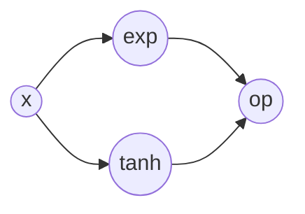

# 预备知识
## 矩阵基本概念
在下面的公式推导中，我们都用小写字母表示标量，比如$x, y, z$，用小写的加箭头字母表示向量，比如$\vec{x}, \vec{y}, \vec{z}$，所有的公式中使用的向量都是列向量，比如长度为$\left|\vec{x}\right|=n$的向量为：
$$
\vec{x}=\begin{bmatrix} x_1 \\\\ x_2 \\\\ \vdots \\\\  x_n\end{bmatrix}
$$
行向量用其转置来表示，也就有：
$$
\vec{x}^\intercal=\begin{bmatrix} x_1 & x_2 & \dots &  x_n\end{bmatrix}
$$

### 逐点乘积(Hadamard Product, Element-wise Multiplication)
相同维度的向量或者矩阵每个元素的乘积，结果是一个向量，记为$\bm{w}\odot\bm{x}$，表示的运算为：

$$
\vec{w}\odot\vec{x}=\begin{bmatrix} w_1x_1 \\\\ w_2x_2 \\\\ \vdots \\\\  w_nx_n\end{bmatrix}
$$

### 点积(Dot Product)
我们用$\vec{w}\cdot\vec{x}$表示向量的点积，点积的结果是一个标量：
$$
\vec{w}\cdot\vec{x}=\sum_{i}^{n}{w_ix_i}=sum(\vec{w}\odot\vec{x})
$$

### 外积(Outer Product)
我们用$\vec{u} \otimes \vec{v}$表示向量$|\vec{u}|=m$和向量$|\vec{v}|=n$的外积，外积的结果是一个$m \times n$的矩阵：
$$
  \vec{u} \otimes \vec{v}=
  \begin{bmatrix}
    u_{1} v_{1} & u_{1} v_{2} & \cdots & u_{1} v_{n} \\\\
    u_{2} v_{1} & u_{2} v_{2} & \cdots & u_{2} v_{n} \\\\
    \vdots & \vdots & \ddots & \vdots \\\\
    u_{n} v_{1} & u_{n} v_{2} & \cdots & u_{m} v_{n}
  \end{bmatrix}
$$

### 梯度(Gradient)
梯度是多元变量函数中输出标量对于输入参数的导数，对于函数$f:\R^n \mapsto \R$，其对输入向量$\vec{x}$的梯度记为：
$$
  \nabla f=
    \begin{bmatrix}
      \frac{\partial{f}}{\partial{x_1}} \\\\
      \frac{\partial{f}}{\partial{x_2}} \\\\
      \vdots \\\\
      \frac{\partial{f}}{\partial{x_n}}
    \end{bmatrix}
$$
梯度是一个向量，表示对输入的变化输出增长最快的方向，这句话怎么直观的理解呢？



举个实际的例子，假设我们有函数$f=x^2+y^2$，有一个输入点$A(1, 1)$，我们怎样移动$A$才能使$f$的变化最大？我们假设只能移动距离为1，在二维空间我们可以以$A$为圆心随意移动，我们只用求$f$变化最大的值就可以了，我们可以三角函数表示移动后的点，假设为$B(A_x+cos(\theta), A_y+sin(\theta))$，带入$f$得到$f=...+2(sin(\theta)+cos(\theta))$，我们知道只有$\theta=45^{\circ}$的时候值才是最大的，也就是我们如果让$A$沿着45度角的方向走的话$f$变化是最大的。 这种解法给了我们一个直观的解释，$A$按照某一个特定的方向向量走才能找到最大值，观察一下就可以发现它刚好是两个偏导数组成的方向$\overrightarrow{OA}(2, 2)$，但是不是所有的函数都可以这么解，如果函数比较复杂，或者维度比较高的时候就很难求解了，这个时候我们要用更微观的角度去看，也就是到了微分的领域，更具体的在多元变量函数里边我们用全微分来考察一下这两者的关系。

全微分说的是我们有一个函数$f(x, y, z)$其结果的增量为所有自变量乘以偏导的和:
$$
df=\frac{\partial f}{\partial x}dx+\frac{\partial f}{\partial y}dy+\frac{\partial f}{\partial z}dz
$$

这里每一项表示对一个微小的自变量变化，比如$dx$对结果的贡献是$x$的偏微分乘以$dx$，这里的操作实际上是固定了一个关于$x$的截面，在这个截面里边$x$和$f$是对应关系，$y$和$z$是常数，用导数乘以$x$的变化量就是$f$的变化量，这跟在一维空间里边用导数求结果增量的行为是一致的。 但是为什么最终的结果三项相加呢？这里使用的是一种线性近似的技术(Local Linear Approximation)[^4]，当变化量趋近于无穷小的时候等式成立：
$$
f\left(x,y\right)\approx f\left(a,b\right) + \frac{\partial f}{\partial x} \left(a,b\right)\left(x-a\right) + \frac{\partial f}{\partial y} \left(a,b\right)\left(y-b\right).
$$

这个全微分我们可以看做是两个向量的点积，也就是
$$
df=
  \begin{bmatrix}
    \frac{\partial f}{\partial x} \\\\
    \frac{\partial f}{\partial y} \\\\
    \frac{\partial f}{\partial z}
  \end{bmatrix} \cdot
  \begin{bmatrix}
    dx \\\\
    dy \\\\
    dz
  \end{bmatrix} = \nabla f \cdot \vec{e}
$$

当我们沿着任意一个方向向量$\vec{u}$走的时候其实可以将其可以看做是以$dx, dy, dz$为基底的线性组合，也就有了更一般的形式：
$$
df = \nabla f \vec{u}
$$

我们知道当这两个向量的夹角为0的时候点积的结果最大，也就是$\nabla f$和$\vec{u}$是一个方向，我们就将前面用偏微分表示的的向量称作梯度，这也就说明了为什么梯度的方向是结果变化最快的方向:
$$
\nabla f=
  \begin{bmatrix}
    \frac{\partial f}{\partial x} \\\\
    \frac{\partial f}{\partial y} \\\\
    \frac{\partial f}{\partial z}
  \end{bmatrix}
$$

换句话说在$f$定义域内的一个点，如果这个点按照梯度的方向一直走，它就会一直走直到找到一个$f$的极大值点，相反如果它一直按照梯度的反方向走，那么它就会找到一个极小值点，这个时候各个自变量的偏导都可能是0了，也就不能再往下走了。更具体点有这么个函数$l=\vec{w}^\intercal\vec{x}$，其中$\vec{x}$是固定的，我们怎么调整$\vec{w}$才能让$l$变小呢？让$\vec{w}^\intercal$按照梯度的反方向就可以了，这也就是梯度下降的基本原理了。


### 雅各比矩阵(Jacobian)
在上面其实我们用线性近似的方式解决了多元函数在局部空间的一维增量计算，但是实际上还有更一般的情况，也就是结果是一个向量，而不是一个标量：
$$
f: \R \mapsto \R \nlspc
f(\vec{x}): \R^n \mapsto \R \nlspc
\vec{f}(\vec{x}): \R^n \mapsto \R^m
$$
前两类的结构都是一个标量，最后一个结果是一个向量，我们怎么近似向量呢，怎么来衡量向量的接近程度呢？实际上现有的方法并不是综合考虑结果向量，而是让每一个向量的元素都接近来近似的，也就是说对于下面的映射$\R^2 \mapsto \R^3$
$$
\begin{bmatrix}
  y_1 \\\\ y_2 \\\\ y_3
\end{bmatrix}=
\begin{bmatrix}
  f_1(\vec{x}) \\\\
  f_2(\vec{x}) \\\\
  f_3(\vec{x})
\end{bmatrix}=
\begin{bmatrix}
  f_1(x_1, x_2) \\\\
  f_2(x_1, x_2) \\\\
  f_3(x_1, x_2)
\end{bmatrix}
$$
我们可以用下面的方式，对于我们知道输入的一个点$(a, b)$的值，我们可以用导数乘以变化量的方式估算两个方向都有微小的变化$(x, y)$的值：
$$
f_1\left(x,y\right)\approx f_1\left(a,b\right) + \pdiff{f_1}{x}\left(a,b\right)\left(x-a\right) + \pdiff{f_1}{y} \left(a,b\right)\left(y-b\right) \nlspc
f_2\left(x,y\right)\approx f_2\left(a,b\right) + \pdiff{f_2}{x}\left(a,b\right)\left(x-a\right) + \pdiff{f_2}{y} \left(a,b\right)\left(y-b\right) \nlspc
f_3\left(x,y\right)\approx f_3\left(a,b\right) + \pdiff{f_3}{x}\left(a,b\right)\left(x-a\right) + \pdiff{f_3}{y} \left(a,b\right)\left(y-b\right)
$$
在考虑无穷小的时候也就有向量的全微分公式：
$$
\begin{bmatrix}
  df_1=\pdiff{f_1}{x_1}dx_1+\pdiff{f_1}{x_2}dx_2 \nlspc
  df_2=\pdiff{f_2}{x_1}dx_1+\pdiff{f_2}{x_2}dx_2 \nlspc
  df_3=\pdiff{f_3}{x_1}dx_1+\pdiff{f_3}{x_2}dx_2
\end{bmatrix}
$$
整理一下可以表示成矩阵乘以一个向量的形式，表达的意思也更明确，一个向量在定义域内的微小变动对输出向量的影响可以用Jacobian表达出来，表达的基本思维是用了线性近似的方式：
$$
\begin{bmatrix} df_1 \nlspc df_2 \nlspc df_3 \nlspc \end{bmatrix}=
\begin{bmatrix}
 \pdiff{f_1}{x_1}&\pdiff{f_1}{x_2} \nlspc
 \pdiff{f_2}{x_1}&\pdiff{f_2}{x_2} \nlspc
 \pdiff{f_3}{x_1}&\pdiff{f_3}{x_2} \nlspc
\end{bmatrix}
\begin{bmatrix} dx_1 \nlspc dx_2 \end{bmatrix}
$$
我们将矩阵的部分叫做Jacobian矩阵，可以看到`Jacobian的表示方式跟Gradient并无二致，只是简单的将向量的单个分量分开表示`，那这种方式是不是有优化的空间呢？

现在将其写作一般的形式有
$$
J_f(x)=\pdiff{\vec{y}}{\vec{x}}=
  \begin{bmatrix}
    \pdiff{f_1}{\vec{x}} \nlspc
    \pdiff{f_2}{\vec{x}} \nlspc
    \vdots \nlspc
    \pdiff{f_m}{\vec{x}}
  \end{bmatrix}=
  \begin{bmatrix}
    \pdiff{f_1}{x_1}& \pdiff{f_1}{x_2}& \ldots & \pdiff{f_1}{x_n} \nlspc
    \pdiff{f_2}{x_1}& \pdiff{f_2}{x_2}& \ldots & \pdiff{f_2}{x_n} \nlspc
    \vdots & \vdots & \ddots & \vdots  \nlspc
    \pdiff{f_m}{x_1}& \pdiff{f_m}{x_2}& \ldots & \pdiff{f_m}{x_n}
  \end{bmatrix}= \nlspc
  \begin{bmatrix}
    \pdiff{\vec{f}}{x_1}& \pdiff{\vec{f}}{x_2}& \ldots & \pdiff{\vec{f}}{x_n}
  \end{bmatrix}=
  \begin{bmatrix}
    \nabla{f_1}(\vec{x})^\intercal \nlspc
    \nabla{f_2}(\vec{x})^\intercal \nlspc
    \vdots \nlspc
    \nabla{f_m}(\vec{x})^\intercal
  \end{bmatrix}
$$
> 注意最后一步是因为梯度是按列排布的，转置之后才会放到行上面，所以是每一个函数的梯度的转置而不是整体函数的转置。

#### JVP(Jacobian Vector Product)
将Jacobian右乘一个向量$\vec{v}\in\R^n$我们就得到了`JVP`形式，注意最后的矩阵里边是点乘，最后的结果是一个$(M, 1)$的向量：

$$
J_f(x)\vec{v} = 
  \begin{bmatrix}
    \nabla{f_1}(\vec{x})^\intercal \nlspc
    \nabla{f_2}(\vec{x})^\intercal \nlspc
    \vdots \nlspc
    \nabla{f_m}(\vec{x})^\intercal
  \end{bmatrix} \vec{v}=
  \begin{bmatrix}
    \nabla{f_1}(\vec{x})\cdot\vec{v} \nlspc
    \nabla{f_2}(\vec{x})\cdot\vec{v} \nlspc
    \vdots \nlspc
    \nabla{f_m}(\vec{x})\cdot\vec{v}
  \end{bmatrix}
$$

假如这里的向量是一个one-hot的单位向量的话JVP可以求出原来Jacobian的某一列，比如$\vec{v}=\vec{e_1}=[0, 1, 0, \dots, 0]^\intercal$只有第二个元素是1其他都是0，那么得到的结果是所有函数对$x_1$变量的偏导
$$
J_f(x)\vec{v} = J_f(x)\vec{e_1}=
  \begin{bmatrix}
    \nabla{f_1}(\vec{x})\cdot\vec{e_1} \nlspc
    \nabla{f_2}(\vec{x})\cdot\vec{e_1} \nlspc
    \vdots \nlspc
    \nabla{f_m}(\vec{x})\cdot\vec{e_1}
  \end{bmatrix}=
  \begin{bmatrix}
    \pdiff{f_1}{\vec{x_2}} \nlspc
    \pdiff{f_2}{\vec{x_2}} \nlspc
    \vdots \nlspc
    \pdiff{f_m}{\vec{x_2}}
  \end{bmatrix}
$$

#### VJP(Vector Jacobian Product)
而将Jacobian左乘一个向量$\vec{u}\in\R^m$我们就得到了`VJP`形式，注意左边的向量$\vec{u}$是1行m列的，用了转置表示行向量，最后的矩阵里边也是点乘，所以它是一个$(1, N)$的向量：

$$
\vec{u}^\intercal J_f(x) = \vec{u}^\intercal
  \begin{bmatrix}
    \pdiff{\vec{f}}{x_1}& \pdiff{\vec{f}}{x_2}& \ldots & \pdiff{\vec{f}}{x_n}
  \end{bmatrix}=
  \begin{bmatrix}
    \vec{u}^\intercal\cdot\pdiff{\vec{f}}{x_1}& \vec{u}^\intercal\cdot\pdiff{\vec{f}}{x_2}& \ldots & \vec{u}^\intercal\cdot\pdiff{\vec{f}}{x_n}
  \end{bmatrix}
$$

同样的如果假如这里的向量是一个one-hot的单位向量的话VJP可以求出原来Jacobian的某一行，比如$\vec{u}=\vec{e_1}=[0, 1, 0, \dots, 0]$只有第二个元素是1其他都是0，那么得到的结果是一个函数对所有变量的偏导，也就是$f_2$函数的梯度
$$
\vec{u}^\intercal J_f(x) = \vec{e_1}^\intercal J_f(x) = 
  \begin{bmatrix}
    \pdiff{\vec{f_2}}{x_1}& \pdiff{\vec{f_2}}{x_2}& \ldots & \pdiff{\vec{f_2}}{x_n}
  \end{bmatrix} = \nabla f_2(\vec{x})
$$

### 矩阵的乘法(Matrix Multiplication)

### 矩阵的点乘(Matrix Dot Production)

### 权重的矩阵表示
每个神经元的权重是一个列向量，多个神经元向量组成矩阵，我们遵守常用记号，将其作为神经元的行向量

Tensorflow和Pytorch中的Input矩阵在表示的时候都是将features放到了行上面，多个feature按照多行排布，比如下面表示特征向量有n个元素，有m个向量的$\bm{X}$其形状为$(M, N)$
$$
\bm{X} = \begin{bmatrix} \vec{x_1} \\\\ \vec{x_2} \\\\ \vdots \\\\  \vec{x_m}\end{bmatrix} = \begin{vmatrix}
x_{11} & x_{12} & \dots & x_{1n} \\\\
x_{21} & x_{22} & \dots & x_{2n} \\\\
\vdots & \vdots & \vdots & \vdots \\\\
x_{m1} & x_{m2} & \dots & x_{mn} \\\\
\end{vmatrix}
$$
对权重的放置却略有不同，Tensorflow会将权重向量放到列上，而Pytorch会放到行上，也就是对应于上面的输入向量，有K个神经元，每个神经元是N个特征的话，Tensorflow的表示的形状是$(N, K)$，也就是K个N维的列向量：
$$
\bm{W} = \begin{bmatrix} \vec{w_1}, \vec{w_2},\dots, \vec{w_k}\end{bmatrix} = \begin{vmatrix}
w_{11} & w_{21} & \dots & w_{k1} \\\\
w_{12} & w_{22} & \dots & w_{k2} \\\\
\vdots & \vdots & \vdots & \vdots \\\\
w_{1n} & w_{2n} & \dots & w_{kn} \\\\
\end{vmatrix}
$$
Pytorch的形状却是$(K, N)$，也就是K个N维的行向量：
$$
\bm{W} = \begin{bmatrix} \vec{w_1} \\\\ \vec{w_2} \\\\ \vdots \\\\ \vec{w_k}\end{bmatrix} = \begin{vmatrix}
w_{11} & w_{12} & \dots & w_{1n} \\\\
w_{21} & w_{22} & \dots & w_{2n} \\\\
\vdots & \vdots & \vdots & \vdots \\\\
w_{k1} & w_{k2} & \dots & w_{kn} \\\\
\end{vmatrix}
$$
因此其`Dense/Linear`的做法也不相同，Tensorflow是$\bm{Y}=\bm{X}\bm{W}$，Pytorch的是$\bm{Y}=\bm{X}\bm{W^\intercal}$，得到的结果都是一样的，也就是batch是行，特征是列，有多少行就有多少个batch。

## Tensor基本概念

### Axis and Shape
对于Tensor $\bm{X}\_{i, j, k}$，它的维度也就是轴是从高到低排序的，这也就意味着在2D里边行是0轴，列是1轴，而到了3D里边，channel是0轴，行是1轴，列是2轴，这在reduction操作里边就意味着指定的是哪一个维度，哪一维度就会消失。





### Stride
Tensor的shape和size是用户关心的，而storage和stride是底层实现者需要关注的，一般来说Tensor的底层实现都是1D的，用stride可以将用户的索引变的更简单。

比如一个Tensor $\bm{X}\_{4 \times 2}$，如果是先按行再按列的方式存储，其形状为
$$
  \begin{array}{|c|c|}
    \hline x_1 & x_2 \\\\
    \hline x_3 & x_4 \\\\
    \hline \empsym{x_5} & \empsym{x_6} \\\\
    \hline x_7 & x_8 \\\\
    \hline
  \end{array}
$$
对应的底层storage如下所示，这种存储是连续的，它的strides就是`(2, 1)`，表示在列上移动单位是1，在行上的移动单位是2。
$$
  storage:
  \begin{array}{|c|c|c|c|c|c|c|c|}
    \hline x_1 & x_2 & x_3 & x_4 & \empsym{x_5} & \empsym{x_6} & x_7 & x_8 \\\\ \hline
  \end{array}
$$
假设现在我们要对$\bm{X}$做transpose，行列形状发生变化之后是$\bm{X}\_{2\times 4}$，如果没有stride我们就需要变换底层的storage，但是实际上我们不用变底层的storage，只需要将stride调换即可，变成`(1, 2)`，这样访问的时候列上走两格访问一个元素，换行只需要加一个元素，就可以得到想要的访问顺序。

$$
  \begin{array}{|c|c|c|c|}
    \hline x_1 & x_3 & \empsym{x_5} & x_7 \\\\
    \hline x_2 & x_4 & \empsym{x_6} & x_8 \\\\
    \hline
  \end{array}
$$
$$
  storage:
  \begin{array}{|c|c|c|c|c|c|c|c|}
    \hline x_1 & x_2 & x_3 & x_4 & \empsym{x_5} & \empsym{x_6} & x_7 & x_8 \\\\ \hline
  \end{array}
$$
如果访问的元素坐标是`tensor[i, j]`，并且strides是$(s_1, s_2)$，那么从storage拿元素的公式就是
$$
  storage[s\_1 * i + s_2 * j]
$$

更一般的，我们将其扩展到任意维的tensor的话就有：
$$
  \bm{X}\_{\overrightarrow{index}} = storage[\sum^{|\overrightarrow{index}|}\_i \vec{s}_i*\overrightarrow{index}_i]
$$
### Broadcasting

广播是一种匹配不同形状数组的维度的操作，以便能够对这些数组执行进一步的操作，广播其实类似于类型提升，主要方便写代码的。
> Broadcasting is akin to the well known “type promotion”: in most languages when adding an integer and a float, the integer is auto converted to the float type first.

比如一个有趣的例子，如果让两个向量$\vec{u}\_{1,3}$和向量$\vec{v}\_{3,1}$点乘的话得到的却是一个外积：

$$
  \begin{array}{|c|c|c|}
    \hline \empsym{1} & \empsym{2} & \empsym{3} \\\\
    \hdashline 1&2&3 \\\\
    \hdashline 1&2&3 \\\\
    \hdashline
  \end{array} *
  \begin{array}{|c:c:c:}
    \hline \empsym{1}&1&1 \\\\
    \hline \empsym{2}&2&2 \\\\
    \hline \empsym{3}&3&3 \\\\
    \hline
  \end{array} =
  \begin{array}{|c|c|c|}
    \hline 1&2&3 \\\\
    \hline 2&4&6 \\\\
    \hline 3&6&9 \\\\
    \hline
  \end{array}
$$

高纬的操作很不直观，但是记住这三条rules就会容易理解了[^10]:
> **Rule 1**: If the two arrays differ in their number of dimensions, the shape of the one with fewer dimensions is padded with ones on its leading (left) side.  
> **Rule 2**: If the shape of the two arrays does not match in any dimension, the array with shape equal to 1 in that dimension is stretched to match the other shape.  
> **Rule 3**: If in any dimension the sizes disagree and neither is equal to 1, an error is raised.

算法参考实现如下：
```python
def shape_broadcast(shape1, shape2):
    dims = max(len(shape1), len(shape2))
    out = ()
    shape1 = (1,) * abs(dims - len(shape1)) + shape1
    shape2 = (1,) * abs(dims - len(shape2)) + shape2
    for s1, s2 in zip(shape1, shape2):
        if s1 == 1:
            o = s2
        elif s2 == 1:
            o = s1
        elif s1 == s2:
            o = s1
        elif s1 != s2:
            raise IndexingError(s1, s2)
        out += (o,)
    return out

t = minitorch.shape_broadcast((2, 5, 1, 8, 4), (3, 1, 4))
assert minitorch.shape_broadcast(t, (5, 1, 8, 1)) == (2, 5, 3, 8, 4)
```

### Indexing and Slicing
这里主要关注的点是Slicing会创建一个view，这个view复用了原来的storage，只是shape和stride发生了变化。例如一个矩阵$\bm{B}\_{3,4}$，strides是`(4, 1)`，然后对其切片`B[1:3,1:3]`，其底层的storage不变，stride仍然是`(4, 1)`，但是后者的起始位置发生了变化，可以表示如下




### Contiguity
我们知道Tensor的layout有两种，一种是Row Major(C order)，一种是Column Major(Fortran Order)，但是在大多数的计算库中两种都支持，为什么可以支持两种表示，支持两种有什么好处，额外的负担是什么呢？

用C order的话越低的维度的stride就越大，而Fortan则相反。判断连续性的方法是
```c
 /*
 * The traditional rule is that for an array to be flagged as C contiguous,
 * the following must hold:
 *
 * strides[-1] == itemsize
 * strides[i] == shape[i+1] * strides[i + 1]
 *
 * And for an array to be flagged as F contiguous, the obvious reversal:
 *
 * strides[0] == itemsize
 * strides[i] == shape[i - 1] * strides[i - 1]
 */
```
有了连续性标志有两方面的好处，如果是C order的话，对于连续性的内存可以连续性的遍历每一个元素，不用跳跃，因此可以用向量化等优化计算；另一个好处是如果是reshape操作的话，可以不用copy到另一个数组，也就是`reval`操作的作用[^11]。

# 求导

## 链式法则(Chain Rule)

级联函数或者组合函数求导为什么要用乘法呢？为什么不是加法或者除法呢？有这样一个例子，汽车在从山脚到山顶开，高度每小时升高1km，而山上的温度是每上升1km下降5$^\circ C$，那最终汽车开了两个小时温度上升多少度呢？显然要用乘法$2 \times 5$也就是10度，虽然这里时间很长，但是当我们看一个微小的变化量的时候，这个结果依然成立，这就可以给复合函数变化率为什么要用乘法提供一个直观的理解。

那分叉的函数为什么要用加法呢？比如下面的两个分支，最后的结果的操作`op`无论是什么，求导的时候都是将几部分相加。
$$
  y_1 = exp(x) \nlspc
  y_2 = tanh(x) \nlspc
  y = y_1 \circ y_2
$$

这是因为我们计算微分的时候用的线性近似，即便最后的`op`是一个$y^z$这样的形式，其增量仍然是两个变量的全微分形式也即两部分引起的增量的加和，这也就解释了为什么总是有一个加法，因为`线性近似总是两个分量引起的最终变化量的线性加法和`，注意下面的加号：

$$
\delta = f\left(x,y\right) - f\left(a,b\right) \approx \frac{\partial f}{\partial x} \left(a,b\right)\left(x-a\right) \empsym{+} \frac{\partial f}{\partial y} \left(a,b\right)\left(y-b\right)
$$

在实现的时候呢，我们要先建立一个DAG，然后拓扑排序之后才能实现累计的效果。

## 标量对向量求导
对于函数$f(\vec{x})=y$, $y$对输入$\vec{x}$的导数我们统一按照Jacobian的方式存放，也就是：
$$
\frac{dy}{d\vec{x}}=
  \begin{bmatrix}
    \frac{df}{dx_1} & \frac{df}{dx_2} & \dots & \frac{df}{dx_n}
  \end{bmatrix}
$$
## 向量对向量求导
不同于上面的$y$是一个标量，这里的$\vec{y}$是一个m维的向量，对应的表达式是$\vec{y}=\vec{f}(\vec{x})$展开之后是：
$$
\begin{bmatrix}
  y_1 \\\\ y_2 \\\\ \vdots \\\\ y_m
\end{bmatrix}=
\begin{bmatrix}
  f_1(\vec{x}) \\\\
  f_2(\vec{x}) \\\\
  \vdots \\\\
  f_m(\vec{x}) \\\\
\end{bmatrix}=
\begin{bmatrix}
  f_1(x_1, x_2, ..., x_n) \\\\
  f_2(x_1, x_2, ..., x_n) \\\\
  \vdots \\\\
  f_n(x_1, x_2, ..., x_n) \\\\
\end{bmatrix}
$$

而$\vec{y}$对$\vec{x}$的导数也就成了对$\vec{x}$各个分量的偏导数，也就是Jacobian矩阵：

$$
\pdiff{\vec{y}}{\vec{x}}=
  \begin{bmatrix}
    \pdiff{f_1}{\vec{x}} \nlspc
    \pdiff{f_2}{\vec{x}} \nlspc
    \vdots \nlspc
    \pdiff{f_m}{\vec{x}}
  \end{bmatrix}=
    \begin{bmatrix}
      \pdiff{f_1}{x_1}&
      \pdiff{f_1}{x_2}&
      \ldots &
      \pdiff{f_1}{x_n} \nlspc
      \pdiff{f_2}{x_1}&
      \pdiff{f_2}{x_2}&
      \ldots &
      \pdiff{f_2}{x_n} \nlspc
      \vdots & \vdots & \ddots & \vdots  \nlspc
      \pdiff{f_m}{x_1}&
      \pdiff{f_m}{x_2}&
      \ldots &
      \pdiff{f_m}{x_n}
    \end{bmatrix}
$$

### 逐元素(Element-wise)操作的求导
这种比较常出现在激活函数，也就是对输入向量的每个元素求值，更泛化的形式是两个矩阵逐个进行binary操作，我们将其记为$\vec{y}=\vec{f}(\vec{w})\odot\vec{g}(\vec{x})$，这里的$\vec{y}, \vec{f}, \vec{g}, \vec{w},\vec{x}$都是向量并且其长度都是n，也就有：
$$
\begin{bmatrix}
  y_1 \\\\ y_2 \\\\ \vdots \\\\ y_n
\end{bmatrix}=
\begin{bmatrix}
  f_1(\vec{w}) \odot g_1(\vec{x}) \\\\
  f_2(\vec{w}) \odot g_2(\vec{x}) \\\\
  \vdots \\\\
  f_n(\vec{w}) \odot g_n(\vec{x}) \\\\
\end{bmatrix}=
\begin{bmatrix}
  f_1(w_1, w_2, ..., w_n) \odot g_1(x_1, x_2, ..., x_n) \\\\
  f_2(w_1, w_2, ..., w_n) \odot g_2(x_1, x_2, ..., x_n) \\\\
  \vdots \\\\
  f_n(w_1, w_2, ..., w_n) \odot g_n(x_1, x_2, ..., x_n) \\\\
\end{bmatrix}
$$
套用上面Jacobian的一般形式我们得到：
$$
\pdiff{\vec{y}}{\vec{x}}=
  \begin{bmatrix}
    \pdiff{(f_1\odot g_1)}{\vec{x}} \nlspc
    \pdiff{(f_2\odot g_2)}{\vec{x}} \nlspc
    \vdots \nlspc
    \pdiff{(f_n\odot g_n)}{\vec{x}}
  \end{bmatrix}=
  \begin{bmatrix}
    \pdiff{(f_1\odot g_1)}{x_1}&
    \pdiff{(f_1\odot g_1)}{x_2}&
    \ldots &
    \pdiff{(f_1\odot g_1)}{x_n} \nlspc
    \pdiff{(f_2\odot g_2)}{x_1}&
    \pdiff{(f_2\odot g_2)}{x_2}&
    \ldots &
    \pdiff{(f_2\odot g_2)}{x_n} \nlspc
    \vdots & \vdots & \ddots & \vdots  \nlspc
    \pdiff{(f_n\odot g_n)}{x_1}&
    \pdiff{(f_n\odot g_n)}{x_2}&
    \ldots &
    \pdiff{(f_n\odot g_n)}{x_n}
  \end{bmatrix}
$$

在深度学习中我们的操作如果是参数乘以输入的话呢，$\vec{f}, \vec{g}$就都是相当于一个选择函数，即$f_i(\vec{w})=w_i$和$g_i(\vec{x})=x_i$，这样面的矩阵就会变成一个对角阵
$$
\begin{bmatrix}
  y_1 \\\\ y_2 \\\\ \vdots \\\\ y_n
\end{bmatrix}=
\begin{bmatrix}
  f_1(\vec{w}) \odot g_1(\vec{x}) \\\\
  f_2(\vec{w}) \odot g_2(\vec{x}) \\\\
  \vdots \\\\
  f_n(\vec{w}) \odot g_n(\vec{x}) \\\\
\end{bmatrix}=
\begin{bmatrix}
  w_1 \odot x_1 \\\\
  w_2 \odot x_2 \\\\
  \vdots \\\\
  w_n \odot x_n \\\\
\end{bmatrix}
$$
也就是说$y_1$只跟$x_1$有关，$y_2$只跟$x_2$有关，$y_n$只跟$x_n$有关，其他位置的元素都无关，也就是：
$$
\pdiff{\vec{y}}{\vec{x}}=
  \begin{bmatrix}
    \pdiff{(w_1\odot x_1)}{\vec{x}}\nlspc
    \pdiff{(w_2\odot x_2)}{\vec{x}}\nlspc
    \vdots\nlspc
    \pdiff{(w_n\odot x_n)}{\vec{x}}
  \end{bmatrix}=
  \begin{bmatrix}
    \pdiff{(w_1\odot x_1)}{x_1}& 0& \ldots & 0\nlspc
    0& \pdiff{(w_2\odot x_2)}{x_2}& \ldots & 0\nlspc
    \vdots & \vdots & \ddots & \vdots \nlspc
    0& 0& \ldots & \pdiff{(w_n\odot x_n)}{x_n}
  \end{bmatrix}=
  \begin{bmatrix}
    w_1&0&\ldots&0 \\\\
    0&w_2&\ldots&0 \\\\
    \vdots&\vdots&\ddots&\vdots\\\\
    0&0&\ldots&w_n \\\\
  \end{bmatrix}
$$
如果这里是乘法的话就变成了参数的对角矩阵，同样的对参数的导数是关于输入向量的导数。我们用代码来验证一下结果是否正确，我们调用Pytorch的`jacobian`来计算一下，首先我们需要引入一些必要的基础库，后面我们不再列出：
```python
import torch
from torch.autograd.functional import jacobian
from torch import tensor
```
我们计算一个element-wise的矩阵乘法并分别对两个向量求导，可以看到结果跟我们上面的公式一致。
```python
x = tensor([1., 2, 3])
w = tensor([4., 5, 6])

y = w * x
dx = jacobian(lambda x: w * x, x)
dw = jacobian(lambda w: w * x, w)
print(f'y: {y},\n\ndy/dx: {dx},\n\ndy/dw: {dw}')

# output
# y: tensor([ 4., 10., 18.]),
# 
# dy/dx: tensor([[4., 0., 0.],
#         [0., 5., 0.],
#         [0., 0., 6.]]),
# 
# dy/dw: tensor([[1., 0., 0.],
#         [0., 2., 0.],
#         [0., 0., 3.]]
```

### 点积(dot product)的求导
向量的点积表示为$y=\vec{w}\cdot\vec{x}$，也可以表示为$\vec{w}^\intercal\vec{x}$，同时还可以看作是element-wise向量乘操作之后再执行一个加和操作，也就是$\sum_i^n{w_ix_i}=sum(\vec{w}\odot\vec{x})$，借用这个转换我们可以利用链式法则求出向量点积的导数[^1]。

我们先定义一个中间变量$\vec{u}$将表达式重写
$$
\vec{u}=\vec{w}\odot\vec{x} \\\\
y=sum(\vec{u})
$$
然后求各个中间变量对于$\vec{w}$的导数
$$
\frac{\partial{u}}{\partial{w}}=diag(\vec{x})= 
\begin{bmatrix}
  x_1&0&\dots&0\\\\
  0&x_2&\dots&0\\\\
  \vdots&\vdots&\ddots&\vdots\\\\
  0&0&\dots&x_n
\end{bmatrix} \\\\
\frac{\partial{y}}{\partial{u}}=\vec{1}^\intercal = [1_1, 1_2, ..., 1_n]
$$

两个中间结果的乘积就是对$\vec{w}$的导数

$$
\frac{\partial{y}}{\partial{\vec{w}}}=
  \frac{\partial{y}}{\partial{\vec{u}}}\frac{\partial{\vec{u}}}{\partial{\vec{w}}}=
  \vec{1}^\intercal diag(\vec{x})=[x_1, x_2, \dots, x_n]=\vec{x}^\intercal
$$

同样的如果我们得到对$\vec{x}$的导数
$$
\frac{\partial{y}}{\partial{\vec{x}}}=\vec{w^\intercal}
$$

另一种证明方法，我们先把$y$展开
$$
y = w_1x_1 + w_2x_2 + \dots + w_nx_n
$$
对其中的任意一个$w_i$求导，我们得到
$$
\frac{\partial y}{\partial w_i} = x_i
$$
也就有：
$$
\pdiff{y}{\vec{w}}=[x_1, x_2, \dots, x_n]=\vec{x}^\intercal
$$
具体的存放形式由实际实现来定。用代码验证一下
```python
x = tensor([1., 2, 3])
w = tensor([4., 5, 6])

y = torch.dot(w, x)
dx = jacobian(lambda x: torch.dot(w, x), x)
dw = jacobian(lambda w: torch.dot(w, x), w)
print(f'y: {y},\n\ndy/dx: {dx},\n\ndy/dw: {dw}')
# y: 32.0,
# 
# dy/dx: tensor([4., 5., 6.]),
# 
# dy/dw: tensor([1., 2., 3.])
```
可以看到`torch.dot`的计算结果跟我们算出来的是一样的，而且这里Pytorch选择了放到行向量里边。
```python
x = tensor([[1.], [2.], [3.]])
w = tensor([4., 5, 6])

y = torch.matmul(w, x)
dx = jacobian(lambda x: torch.matmul(w, x), x)
dw = jacobian(lambda w: torch.matmul(w, x), w)
print(f'y: {y},\n\ndy/dx: {dx},\n\ndy/dw: {dw}')
print(dx.shape, dw.shape)
# y: tensor([32.]),
# 
# dy/dx: tensor([[[4.],
#          [5.],
#          [6.]]]),
# 
# dy/dw: tensor([[1., 2., 3.]])
# torch.Size([1, 3, 1]) torch.Size([1, 3])
```
但是看`torch.matmul`就跟我们求出来的基本一致，但是这里`y`是一个1x1矩阵，`dx`的形状也多了一维，但是仍然可以进行减法计算，而`dw`的形状是对的。

`torch.matmul`还有一个性质就是如果输入都是一维向量的话结果是求两个的点积，也就是跟点积完全一样了，所以应该`torch.dot`底层也是用`torch.matmul`实现的。
```python
x = tensor([1., 2, 3])
w = tensor([4., 5, 6])

y = torch.matmul(w, x)
dx = jacobian(lambda x: torch.matmul(w, x), x)
dw = jacobian(lambda w: torch.matmul(w, x), w)
print(f'y: {y},\n\ndy/dx: {dx},\n\ndy/dw: {dw}')
# y: 32.0,
# 
# dy/dx: tensor([4., 5., 6.]),
# 
# dy/dw: tensor([1., 2., 3.])
```
### 矩阵乘向量对向量求导
多个神经元与对应一个输入向量的矩阵乘情形就是一个典型的矩阵乘向量的例子，我们表示为$\vec{y}=\bm{W}\vec{x}$，我们要求的导数是$\frac{\partial{\vec{y}}}{\partial{\vec{x}}}$，其中$\vec{x}$的是$N$维的向量，$\vec{y}$是$M$维的向量，而矩阵$\bm{W}$的形状是$(M, N)$，我们先将计算过程写成展开模式方便理解
$$
\begin{bmatrix}
  y_1 \\\\ y_2 \\\\ \vdots \\\\ y_m
\end{bmatrix}=
\begin{bmatrix}
  f_1(\vec{x}) \\\\
  f_2(\vec{x}) \\\\
  \vdots \\\\
  f_m(\vec{x}) \\\\
\end{bmatrix}=
\begin{bmatrix}
  f_1(x_1, x_2, ..., x_n) \\\\
  f_2(x_1, x_2, ..., x_n) \\\\
  \vdots \\\\
  f_n(x_1, x_2, ..., x_n) \\\\
\end{bmatrix}=\nlspc
\begin{bmatrix}
  W_{11}x_1+W_{12}x_2+\dots+W_{1n}x_n \\\\
  W_{21}x_1+W_{22}x_2+\dots+W_{2n}x_n \\\\
  \vdots \\\\
  W_{m1}x_1+W_{m2}x_2+\dots+W_{mn}x_n \\\\
\end{bmatrix}=\nlspc
\begin{bmatrix}
  \sum\limits_{i=1}^{N}{W_{1i}x_i}\\\\
  \sum\limits_{i=1}^{N}{W_{2i}x_i}\\\\
  \vdots \\\\
  \sum\limits_{i=1}^{N}{W_{mi}x_i}\\\\
\end{bmatrix}
$$
因为输入输出都是向量，我们就能够得到Jacobian的形式：
$$
\frac{\partial{\vec{y}}}{\partial{\vec{x}}}=
\begin{bmatrix}
  \frac{\partial{\sum\limits_{i=1}^{N}{W_{1i}x_i}}}{\partial{x_1}}&
  \frac{\partial{\sum\limits_{i=1}^{N}{W_{1i}x_i}}}{\partial{x_2}}&
  \dots&
  \frac{\partial{\sum\limits_{i=1}^{N}{W_{1i}x_i}}}{\partial{x_n}}&\nlspc
  \frac{\partial{\sum\limits_{i=1}^{N}{W_{2i}x_i}}}{\partial{x_1}}&
  \frac{\partial{\sum\limits_{i=1}^{N}{W_{2i}x_i}}}{\partial{x_2}}&
  \dots&
  \frac{\partial{\sum\limits_{i=1}^{N}{W_{2i}x_i}}}{\partial{x_n}}&\nlspc
  \vdots&\vdots&\ddots&\vdots \nlspc
  \frac{\partial{\sum\limits_{i=1}^{N}{W_{mi}x_i}}}{\partial{x_1}}&
  \frac{\partial{\sum\limits_{i=1}^{N}{W_{mi}x_i}}}{\partial{x_2}}&
  \dots&
  \frac{\partial{\sum\limits_{i=1}^{N}{W_{mi}x_i}}}{\partial{x_n}}
\end{bmatrix}=
\begin{bmatrix}
  W_{11}&W_{12}&\dots&W_{1n}\\\\
  W_{21}&W_{22}&\dots&W_{2n}\\\\
  \vdots&\vdots&\ddots&\vdots\\\\
  W_{m1}&W_{m2}&\dots&W_{mn}\\\\
\end{bmatrix}=W
$$
如果是行向量的模式的话，计算公式变为了$\vec{y}=\vec{x}\bm{W}$，这里$W$的形状变成了$(N, M)$相应的计算展开式是
$$
\begin{bmatrix}
  y_1 & y_2 & \dots & y_m
\end{bmatrix}=
\begin{bmatrix}
  f_1(\bm{x}) &
  f_2(\bm{x}) &
  \dots &
  f_m(\bm{x})
\end{bmatrix}=\nlspc
\begin{bmatrix}
  f_1(x_1, x_2, ..., x_n) &
  f_2(x_1, x_2, ..., x_n) &
  \dots &
  f_n(x_1, x_2, ..., x_n) &
\end{bmatrix}=\nlspc
\begin{bmatrix}
  x_1W_{11}+x_2W_{21}+\dots+x_nW_{n1} &
  x_1W_{12}+x_2W_{22}+\dots+x_nW_{n2} &
  \dots &
  x_1W_{1m}+x_2W_{2m}+\dots+x_nW_{nm}
\end{bmatrix}=\nlspc
\begin{bmatrix}
  \sum\limits_{i=1}^{N}{x_iW_{i1}}&
  \sum\limits_{i=1}^{N}{x_iW_{i2}}&
  \dots &
  \sum\limits_{i=1}^{N}{x_iW_{im}}
\end{bmatrix}
$$
注意行向量的结果已经被占据行了，因此其导数矩阵应该往下延伸，也就是
$$
\frac{\partial{\vec{y}}}{\partial{\vec{x}}}=
\begin{bmatrix}
  \frac{\partial{\sum\limits_{i=1}^{N}{x_iW_{i1}}}}{\partial{x_1}}&
  \frac{\partial{\sum\limits_{i=1}^{N}{x_iW_{i2}}}}{\partial{x_2}}&
  \dots
  \frac{\partial{\sum\limits_{i=1}^{N}{W_{1i}x_i}}}{\partial{x_n}}\nlspc
  \frac{\partial{\sum\limits_{i=1}^{N}{W_{2i}x_i}}}{\partial{x_1}}&
  \frac{\partial{\sum\limits_{i=1}^{N}{W_{2i}x_i}}}{\partial{x_2}}&
  \dots
  \frac{\partial{\sum\limits_{i=1}^{N}{W_{2i}x_i}}}{\partial{x_n}}\nlspc
  \vdots \nlspc
  \frac{\partial{\sum\limits_{i=1}^{N}{W_{mi}x_i}}}{\partial{x_1}}&
  \frac{\partial{\sum\limits_{i=1}^{N}{W_{mi}x_i}}}{\partial{x_2}}&
  \dots
  \frac{\partial{\sum\limits_{i=1}^{N}{W_{mi}x_i}}}{\partial{x_n}}\nlspc
\end{bmatrix}=
\begin{bmatrix}
  W_{11}&W_{12}&\dots&W_{1n}\\\\
  W_{21}&W_{22}&\dots&W_{2n}\\\\
  \vdots&\vdots&\ddots&\vdots\\\\
  W_{m1}&W_{m2}&\dots&W_{mn}\\\\
\end{bmatrix}=W
$$

## 向量对矩阵求导
向量和矩阵的乘积是一个向量，怎么求向量对矩阵的导数呢？我们考察一下batch个input向量的情形[^2][^3]，也就是假设一个神经元$\bm{w}$，m张图片输入记做$\bm{X}$，其形状是$(M, N)$：
$$
X=
  \begin{bmatrix}
    \vec{x_1},\vec{x_2},\dots,\vec{x_m}
  \end{bmatrix}^\intercal=
  \begin{bmatrix}
    x_{11}&x_{12}&\dots&x_{1n}\nlspc
    x_{21}&x_{22}&\dots&x_{2n}\nlspc
    \vdots&\vdots&\ddots&\vdots\nlspc
    x_{m1}&x_{m2}&\dots&x_{mn}
  \end{bmatrix}
$$
$\vec{y}$的计算方法是
$$
\vec{y}=\bm{X}\vec{w}=\nlspc
  \begin{bmatrix}
    x_{11}&x_{12}&\dots&x_{1n}\nlspc
    x_{21}&x_{22}&\dots&x_{2n}\nlspc
    \vdots&\vdots&\ddots&\vdots\nlspc
    x_{m1}&x_{m2}&\dots&x_{mn}
  \end{bmatrix}
  \begin{bmatrix}
  w_1 \nlspc w_2 \nlspc \vdots \nlspc w_n
  \end{bmatrix}=
  \begin{bmatrix}
  y_1 \nlspc y_2 \nlspc \vdots \nlspc y_m
  \end{bmatrix}
$$
则$\pdiff{\vec{y}}{\bm{X}}$为
$$
\pdiff{\vec{y}}{\bm{X}}=
  \begin{bmatrix}
  \pdiff{y_1}{\bm{X}}\nlspc
  \pdiff{y_2}{\bm{X}}\nlspc
  \vdots\nlspc
  \pdiff{y_m}{\bm{X}}\nlspc
  \end{bmatrix}
$$
其形状为$(M, M, N)$，其最终的形式怎么排似乎没有定论。
## 矩阵对矩阵求导
更复杂的情况是不仅input带上来batch，神经元也有了多个，这个时候输出也变成了矩阵，我们假设有K个神经元，其他形状跟上面一样不变，则有：
$$
\bm{Y_{M,K}}=\bm{X_{M,N}}\bm{W_{N,K}}=\nlspc
  \begin{bmatrix}
    x_{11}&x_{12}&\dots&x_{1n}\nlspc
    x_{21}&x_{22}&\dots&x_{2n}\nlspc
    \vdots&\vdots&\ddots&\vdots\nlspc
    x_{m1}&x_{m2}&\dots&x_{mn}
  \end{bmatrix}
  \begin{bmatrix}
    w_{11}&w_{12}&\dots&w_{1k} \nlspc 
    w_{21}&w_{22}&\dots&w_{2k} \nlspc 
    \vdots&\vdots&\ddots&\vdots\nlspc
    w_{n1}&w_{n2}&\dots&w_{nk} \nlspc 
  \end{bmatrix}=
  \begin{bmatrix}
    y_{11}&y_{12}&\dots&y_{1k}\nlspc
    y_{21}&y_{22}&\dots&y_{2k}\nlspc
    \vdots&\vdots&\ddots&\vdots\nlspc
    y_{m1}&y_{m2}&\dots&y_{mk}
  \end{bmatrix}
$$
如果再按照雅各比矩阵的方式排列，得到的导数$\pdiff{\bm{Y}}{\bm{X}}$的形状就变成了$(M, K, M, N)$

到这里就可以发现我们在深度学习的模型中使用了batch，那么输出输出都可能是矩阵，如果应用链式法则去求梯度就会出现高维偏导矩阵，高维偏导矩阵先不说排布没有统一，即便统一了概念也非常难以理解[^5]，即便理解了也不具有实践意义计算量也会非常的大，那有什么优化的方法呢？我们观察到不直接求导而是求导数乘以方向向量会大量简化计算。

# 求梯度
回忆一下，梯度是多元变量函数中输出标量对于输入参数的导数，我们在[梯度]()这一节知道了梯度的基本形式，也就是对于函数$f:\R^n \mapsto \R$，其对输入向量$\vec{x}$的梯度记为：
$$
  \nabla f=
    \begin{bmatrix}
      \pdiff{f}{x_1} \nlspc
      \pdiff{f}{x_2} \nlspc
      \vdots \nlspc
      \pdiff{f}{x_n}
    \end{bmatrix}
$$
这里`梯度的维度和输入向量的维度是一致的`。

假设存在函数$f: \R^n \mapsto \R^m$，这个函数由如下几个函数组合而成
$$
\vec{y}=\vec{f_4}(\vec{f_3}(\vec{f_2}(\vec{f_1}(\vec{x}))))
$$
其中$f_1: \R^n \mapsto \R^{m_1}, f_2: \R^{m_1} \mapsto \R^{m_2}, f_3: \R^{m_2} \mapsto \R^{m_3}, f_4: \R^{m_3} \mapsto \R^{m}$
如果求$\vec{y}$对$\vec{x}$的Jacobian的话，根据链式求导法则有
$$
\begin{align*}
  J_f(\vec{x})_{m,n}=\pdiff{\vec{y}}{\vec{x}}
  &=\pdiff{\vec{y}}{\vec{x_4}}\pdiff{\vec{x_4}}{\vec{x_3}}\pdiff{\vec{x_3}}{\vec{x_2}}\pdiff{\vec{x_2}}{\vec{x}}\nlspc
  &=\pdiff{\vec{f_4}}{\vec{x_4}}\pdiff{\vec{f_3}}{\vec{x_3}}\pdiff{\vec{f_2}}{\vec{x_2}}\pdiff{\vec{f_1}}{\vec{x}}\nlspc
  &=J{_f{_4}}J{_f{_3}}J{_f{_2}}J{_f{_1}}
\end{align*}
$$
可以看到最后就变成了一个矩阵连乘的最优化问题，虽然是可以用动态规划求得最优解，但是在实际中我们只考虑两种模式也就是forward和backward。

## 正向模式(Forward)
正向模式就是我们先用[JVP]()的方式右乘一个单位方向向量$\vec{v} \in \R^n$，每次只求Jacobian的一列，因为是右乘所以按照$J{_f{_1}}$接着$J{_f{_2}}$的方式直到所有的导数都计算出来就更加的高效，因为每次都只计算一列，一共有n列，就要循环n次才能将整个Jacobian计算出来。

计算过程的形状为
$$
\begin{align*}
  J_f(\vec{x})_{m,n}\vec{v}=\underleftarrow{J{_f{_4}}J{_f{_3}}J{_f{_2}}J{_f{_1}}\vec{v}}
  &=(m, m_3)(m_3, m_2)(m_2, m_1)\undergroup{(m_1, n)(n, 1)} \\\\
  &=(m, m_3)(m_3, m_2)\undergroup{(m_2, m_1)(m_1, 1)}  \\\\
  &=(m, m_3)\undergroup{(m_3, m_2)(m_2, 1)} \\\\
  &=\undergroup{(m, m_3)(m_3, 1)} \\\\
  &=(m, 1)
\end{align*}
$$
从右到左计算矩阵，单次的计算量为$m_1n+m_2m_1+m_3m_2+mm_3$，要计算n次，所以总的计算量为
$$
n(m_1n+m_2m_1+m_3m_2+mm_3)
$$

前向模式的优点是可以一次计算完结果和Jacobian不需要保存中间结果，算法如下：
> $\vec{f}(\vec{x})=\vec{f_K}\circ\dots\circ\vec{f_2}\circ\vec{f_1}$  
> $[\bm{J}\_{\vec{f}}(\vec{x})]\_{:,j}=\bm{J}\_{\vec{f}\_K}(\vec{x}_K)\dots \bm{J}\_{\vec{f}\_2}(\vec{x}_2) \bm{J}\_{\vec{f}\_1}(\vec{x}_1)\vec{e}_j, j \in {1,\dots,n}$  
>
> **Input**: $\vec{x} \in \R^n$  
>
> $\vec{x_1} \leftarrow \vec{x}$  
> $\vec{v_j} \leftarrow \vec{e}_j \in \R^n, j \in {1,\dots,n}$  
>
> ***for*** k = 1 to K ***do***  
> $\quad\vec{x}\_{k+1} \leftarrow \vec{f_k}(\vec{x}_k)$  
> $\quad\vec{v_j} \leftarrow \bm{J}\_{\vec{f}\_k}(\vec{x_k})\vec{v_j}$  
> ***end for***  
>
> ***Returns***: $\vec{x}\_{K+1}, [\bm{J}_f(\vec{x})]\_{:,j}=\vec{v_j}, j \in {1,\dots,n}$
{.framed}

我们用一个简单的例子来验证一下JVP计算的过程，使用的函数较为$\vec{f}=f_3(\vec{f}_2(\vec{f}_1(\vec{x}))),~where ~\vec{f}_1: exp(\vec{x}),~\vec{f}_2: tanh(\vec{x}),~f_3=sum(\vec{x})$，值得注意的点是在求$f_1,~f_2$的JVP的时候我们没有直接求出来Jacobian，然后使用矩阵乘以向量的方式，而是使用了两个向量相乘的形式，这是因为对对$\vec{f}_1$类似于逐元素求导，也就是只有对角线有值其他都为0，而$\vec{v}$又是一个列向量，相乘之后还是一个向量，效果相当于两个向量逐元素乘。从这个角度看也证明了我们在引入方向向量$\vec{v}$之后并不需要计算完整的Jacobian，因此减少了计算量：
$$
  \pdiff{\vec{f}_1}{\vec{x}}\vec{v}=
  \begin{bmatrix}
  exp^{x_1}& 0& 0& 0\nlspc
  0& exp^{x_2}& 0& 0\nlspc
  0& 0& exp^{x_3}& 0\nlspc
  0& 0& 0& exp^{x_4}\nlspc
  \end{bmatrix}
  \begin{bmatrix}
    v_1\nlspc
    v_2\nlspc
    v_3\nlspc
    v_4\nlspc
  \end{bmatrix}=
  \begin{bmatrix}
    exp^{x_1}v_1\nlspc
    exp^{x_2}v_2\nlspc
    exp^{x_3}v_3\nlspc
    exp^{x_4}v_4\nlspc
  \end{bmatrix}=\pdiff{f}{\vec{x}}\odot\vec{v}
$$

而对于$f_3$，其左边是一个$(1, 4)$的Jacobian，右边是一个$(4, 1)$的方向向量，用矩阵乘就可以了，但是实现的时候都因为都是1D的向量，所以直接用了两个向量的点乘。


```python
def f1(x):
    def jvp(v):
        return v*torch.exp(x)
    return jvp, torch.exp(x)

def f2(x):
    def jvp(v):
        return v*(1-torch.tanh(x)*torch.tanh(x))
    return jvp, torch.tanh(x)

def f3(x):
    def jvp(v):
        return torch.ones_like(x).dot(v.T)
    return jvp, torch.sum(x)

x = tensor([1., 2, 3, 4])
es = torch.eye(len(x), len(x))
fs = [f1, f2, f3]
o = None

jab = []
for v in es:
    xi = x
    for f in fs:
        jvp, o = f(xi)
        xi = o
        v = jvp(v)
    jab.append(v)
jab = torch.column_stack(jab)

print('output:', o)
print('jacobian:\n', jab)
# output: tensor(3.9913)
# jacobian:
#  tensor([[4.6937e-02, 1.1451e-05, 0.0000e+00, 0.0000e+00]])

def f(x): return f3(f2(f1(x)[1])[1])[1]
_o = f(x)
_jab = jacobian(f, x)

print('output:', o)
print('jacobian:\n', jab)

torch.allclose(o, _o)
torch.allclose(jab, _jab)
```

## 反向模式(Backward)
反向模式就是我们先用[VJP]()的方式用一个单位方向向量$\vec{v}\in\R^m$右乘最后一个偏导，每次只求Jacobian的一行，因为是单位向量在左边右乘所以按照$J{_f{_4}}$接着$J{_f{_3}}$的方式直到所有的导数都计算出来就更加的高效，因为每次都只计算一行，一共有m列，就要循环m次才能将整个Jacobian计算出来。

计算过程的形状为
$$
\begin{align*}
  \vec{v}J_f(\vec{x})_{m,n}=\underrightarrow{\vec{v}J{_f{_4}}J{_f{_3}}J{_f{_2}}J{_f{_1}}}
  &=\undergroup{(1, m)(m, m_3)}(m_3, m_2)(m_2, m_1)(m_1, n) \\\\
  &=\undergroup{(1, m_3)(m_3, m_2)}(m_2, m_1)(m_1, n)  \\\\
  &=\undergroup{(1, m_2)(m_2, m_1)}(m_1, n) \\\\
  &=\undergroup{(1, m_1)(m_1, n)} \\\\
  &=(1, n)
\end{align*}
$$
从左到右计算矩阵，单次的计算量也为$m_1n+m_2m_1+m_3m_2+mm_3$，只不过顺序要倒过来，要计算m次，所以总的计算量为
$$
m(m_1n+m_2m_1+m_3m_2+mm_3)
$$
但是这里m通常取1，也就是一个向量最终会对应一个损失函数计算出来的标量，也就是计算的复杂度可以降到$O(n^2)$

反向模式的则需要先前项走一遍得到所有的中间结果，然后再利用中间结果反向走一遍得到最终的梯度，算法如下：
> $\vec{f}(\vec{x})=\vec{f_K}\circ\dots\circ\vec{f_2}\circ\vec{f_1}$  
> $[\bm{J}\_{\vec{f}}(\vec{x})]\_{i,:}=\vec{e}_i^\intercal \bm{J}\_{\vec{f}\_K}(\vec{x}_K)\dots \bm{J}\_{\vec{f}\_2}(\vec{x}_2) \bm{J}\_{\vec{f}\_1}(\vec{x}) \quad i \in {1,\dots,m}$  
>
> **Input**: $\vec{x} \in \R^n$  
>
> $\vec{x_1} \leftarrow \vec{x}$  
> $\vec{u_i} \leftarrow \vec{e}_i \in \R^m \quad i \in {1,\dots,m}$  
>
> ***for*** k = 1 to K ***do***  
> $\quad\vec{x}\_{k+1} \leftarrow \vec{f}_k(\vec{x}_k)$  
> ***end for***  
>
> ***for*** k = K to 1 ***do***  
> $\quad\vec{u_i}^\intercal \leftarrow \vec{u_i}^\intercal \bm{J}\_{\vec{f}\_k}(\vec{x_k}) \quad i \in {1,\dots,m}$  
> ***end for***  
>
> ***Returns***: $\vec{x}\_{K+1}, [\bm{J}_f(\vec{x})]\_{i,:}=\vec{u_i}^\intercal \quad i \in {1,\dots,m}$
{.framed}

我们仍然使用上面的例子，不过这次变成使用反向的模式。这里有几个不同，首先是$f_3$，它是一个reduction，Jacobian的形状是$(1, 4)$，方向向量的是根据输出来的也就是$(1, 1)$，得到一个$(1, 4)$的结果，但是因为是1D向量，这里简化成了向量逐元素乘。

另外一个显著不同是，我们先跑一遍前向模式，保存每一层的中间结果，这是因为在反向VJP的时候的时候我们要使用当前层的输入，也就是上一层的输出，实现的时候我们利用一个数组保存所有的中间结果，到某一层的时候我们从数组里边拿到上一层的输出即可。

还有一个需要显著说明的是，这里的`es`其实只有1D，因为最终的结果是一个标量，我们只用计算一次就可以了，而不是像JVP一样的4次。

另外可以看到，其他两个函数我们计算VJP和JVP的方法是一样的，这是因为不论我们左乘一个方向向量还是右乘一个方向向量，得到的都是跟对角线的逐元素乘积，最后的Jacobian是对称的矩阵。

```python
def f3(x):
    def vjp(v):
        return v*torch.ones_like(x)
    return vjp, torch.sum(x)

x = tensor([1., 2, 3, 4])
xi = x
os = [x]
fs = [f1, f2, f3]
for f in fs:
    _, o = f(xi)
    os.append(o)
    xi = o
os = os[:-1]

dim = len(o) if o.dim() != 0 else 1
es = torch.eye(dim, dim)
jab = []
for v in es:
    for i in reversed(range(len(fs))):
        vjp, _ = fs[i](os[i])
        v = vjp(v)
    jab.append(v)
jab = torch.row_stack(jab)

print('output:', o)
print('jacobian:\n', jab)
```

## JVP和VJP的比较
考虑一般情形，对于函数$\bm{F}: \R^n \mapsto \R^m$，如果$m \gg n$，Jacobian的函数的行数比列数多那么使用JVP比较高效，因为JVP每次计算一列也就是m个数，计算的数据更多；相反如果$n \gg m$，这个时候Jacobian有更多的列，那么一次计算一行效率更高也就是一次算出来n个元素，使用VJP效率更高[^6]。在深度学习的大多数场景下都是从一个高维Tensor映射到一个标量，也就是$n \gg m$的情形，这时候就更适合使用VJP模式了。从上面的简单代码也可以看出来VJP是减少了将近3/4的运算，但是缺点就是需要保存中间结果。

## 带batch的高纬求梯度
所有之前的讨论我们都是假设输入是一个向量$|\vec{x}|=n$，因为在求导的时候我们看到了高纬矩阵的偏导数非常复杂，但是考虑到深度学习的输出都是一个$Loss$函数也就是一个标量，最终梯度也是标量对矩阵的导数，再结合VJP的方式高纬求梯度就可以实现了（事实上，如果输出$m=1$的话我们不用再左乘一个单位向量，因为左乘的是$1 \times 1$的向量）。

我们把例子的前后向形状变化表示出来，前向如下：
$$
  \underbrace{\vec{x}}\_{1 \times 4} \xrightarrow{\overrightarrow{exp}}
  \underbrace{\vec{x}\_1}\_{1 \times 4} \xrightarrow{\overrightarrow{tanh}}
  \underbrace{\vec{x}\_2}\_{1 \times 4} \xrightarrow{sum}
  \underbrace{y}_1
$$

反向如下：
$$
  \underbrace{\pdiff{y}{\vec{x}}}\_{1 \times 4}
  \xleftarrow{\underbrace{\pdiff{\vec{x}_1}{\vec{x}}}\_{4 \times 4}} \underbrace{\pdiff{y}{\vec{x}_1}}\_{1 \times 4}
  \xleftarrow{\underbrace{\pdiff{\vec{x}_2}{\vec{x}_1}}\_{4 \times 4}} \underbrace{\pdiff{y}{\vec{x}_2}}\_{1 \times 4}
  \xleftarrow{sum} \underbrace{dy}\_{1 \times 1}
$$

虽然这里写上了对$tanh$和$exp$的偏导数是$4 \times 4$的矩阵，但是实际上我们只算了对角线跟后面来的方向向量的逐元素乘，如果将上面的矩阵乘变成逐元素乘，反向的过程如下：
$$
  \underbrace{\pdiff{y}{\vec{x}}}\_{1 \times 4}
  \xleftarrow{\odot ~\underbrace{Diag(\pdiff{\vec{x}_1}{\vec{x}})}\_{1 \times 4}} \underbrace{\pdiff{y}{\vec{x}_1}}\_{1 \times 4}
  \xleftarrow{\odot ~\underbrace{Diag(\pdiff{\vec{x}_2}{\vec{x}_1})}\_{1 \times 4}} \underbrace{\pdiff{y}{\vec{x}_2}}\_{1 \times 4}
  \xleftarrow{sum} \underbrace{dy}\_{1 \times 1}
$$

当我们把输入的向量扩展成2D，正向的过程就变为了：
$$
  \underbrace{\bm{X}}\_{2 \times 4} \xrightarrow{\overrightarrow{exp}}
  \underbrace{\bm{X}\_1}\_{2 \times 4} \xrightarrow{\overrightarrow{tanh}}
  \underbrace{\bm{X}\_2}\_{2 \times 4} \xrightarrow{sum}
  \underbrace{y}_1
$$

反向变成了下面的形式，我们在求导的章节已经说过矩阵对矩阵的求导形式是不定的：
$$
  \underbrace{\pdiff{y}{\bm{X}}}\_{2 \times 4}
  \xleftarrow{\underbrace{\pdiff{\bm{X}_1}{\bm{X}}}\_{2 \times 4 \times 2 \times 4}} \underbrace{\pdiff{y}{\bm{X}_1}}\_{2 \times 4}
  \xleftarrow{\underbrace{\pdiff{\bm{X}_2}{\bm{X}_1}}\_{2 \times 4 \times 2 \times 4}} \underbrace{\pdiff{y}{\bm{X}_2}}\_{2 \times 4}
  \xleftarrow{sum} \underbrace{dy}\_{1 \times 1}
$$

这里我们观察发现输出的两个通道之间根本就没有关系，可以看作是独立的两部分放到了一起而已，这样就会变成如下的形式：
$$
  \underbrace{\pdiff{y}{\bm{X}}}\_{2 \times 4}
  \xleftarrow{\odot ~\underbrace{Diag(\pdiff{\bm{X}_1}{\bm{X}}}\_{2 \times 4})} \underbrace{\pdiff{y}{\bm{X}_1}}\_{2 \times 4}
  \xleftarrow{\odot ~\underbrace{Diag(\pdiff{\bm{X}_2}{\bm{X}_1}}\_{2 \times 4})} \underbrace{\pdiff{y}{\bm{X}_2}}\_{2 \times 4}
  \xleftarrow{sum} \underbrace{dy}\_{1 \times 1}
$$

如果用个例子来验证的话，可以发现只用将输入再加一个batch就可以了，代码不用做任何变化：
```python
def f1(x):
    def vjp(v):
        return v*torch.exp(x)
    return vjp, torch.exp(x)

def f2(x):
    def vjp(v):
        return v*(1-torch.tanh(x)*torch.tanh(x))
    return vjp, torch.tanh(x)

def f3(x):
    def vjp(v):
        return v*torch.ones_like(x)
    return vjp, torch.sum(x)

x = tensor([[1., 2, 3, 4], [1, 2, 3, 4]])
xi = x
os = [x]
fs = [f1, f2, f3]
for f in fs:
    _, o = f(xi)
    os.append(o)
    xi = o
os = os[:-1]

dim = len(o) if o.dim() != 0 else 1
es = torch.eye(dim, dim)
jab = []
for v in es:
    for i in reversed(range(len(fs))):
        vjp, _ = fs[i](os[i])
        v = vjp(v)
    jab.append(v)
jab = torch.row_stack(jab)

print('output:', o)
print('jacobian:\n', jab)
# output: tensor(7.9827)
# jacobian:
#  tensor([[4.6937e-02, 1.1451e-05, 0.0000e+00, 0.0000e+00],
#         [4.6937e-02, 1.1451e-05, 0.0000e+00, 0.0000e+00]])
```

## 特殊算子求梯度
上面的部分我们只涉及了一类逐元素求值的算子，也就是Unary算子，求法上我们使用了对角阵乘向量相当于两个向量逐点乘这样一种观察，但是这种观察只能对简单的算子有效，下面我们使用一种系统的方法来介绍一些不那么直观的算子怎么求梯度。

首先，当然也要基于VJP的思路；其次，我们不用考虑batch，因为batch之间没有关系，只用简单的罗列就可以了。另外这里我们用的是行向量，因为用行向量跟代码对应起来比较直观，用列向量便于公式推导。对于一个算子来说其一般形式如下，其中只有橙色的部分是未知的，其他部分包括输入输出数据和操作都相当于已知的，而且大多时候反向的偏导矩阵是不用求的，可以直接根据和输出的梯度$g$的关系算出来，比如上面例子中的$exp$函数就直接用点乘替代就可以了。

$$
  \tag{forward} \underbrace{\vec{x}}\_{1 \times n} \xrightarrow{\overrightarrow{op}} 
  \underbrace{\vec{o}}\_{1 \times m} 
$$

$$
  \tag{backward} {\color{#ffa86a}\underbrace{\pdiff{y}{\vec{x}}}\_{1 \times n}}
  \xleftarrow{\underbrace{\pdiff{\vec{o}}{\vec{x}}}\_{m \times n}} \underbrace{\pdiff{y}{\vec{o}}}\_{1 \times m}
$$

### Unary算子
下面的列表来自[aurograd](https://github.com/HIPS/autograd/blob/c6d81ce7eede6db801d4e9a92b27ec5d409d0eab/autograd/numpy/numpy_vjps.py#L69-L142)库，其中`ans`表示当前算子的输出，`x`表示当前算子的输入，`g`表示输出标量对当前输出的梯度，`*`表示点乘，`/`表示点除。
|Function|Gradient|
|---|---|
|negative| -g|
|abs| g * replace_zero(conj(x), 0.) / replace_zero(ans, 1.)|
|fabs| sign(x) * g)  # fabs doesn't take complex numbers.|
|absolute| g * conj(x) / ans|
|reciprocal| - g / x**2|
|exp| ans * g|
|exp2| ans * log(2) * g|
|expm1| (ans + 1) * g|
|log| g / x|
|log2| g / x / log(2)|
|log10| g / x / log(10)|
|log1p| g / (x + 1)|
|sin| g * cos(x)|
|cos| - g * sin(x)|
|tan| g / cos(x) **2|
|arcsin| g / sqrt(1 - x**2)|
|arccos| g / sqrt(1 - x**2)|
|arctan| g / (1 + x**2)|
|sinh| g * cosh(x)|
|cosh| g * sinh(x)|
|tanh| g / cosh(x) **2|
|arcsinh| g / sqrt(x**2 + 1)|
|arccosh| g / sqrt(x**2 - 1)|
|arctanh| g / (1 - x**2)|
|rad2deg| g / pi * 180.0|
|degrees| g / pi * 180.0|
|deg2rad| g * pi / 180.0|
|radians| g * pi / 180.0|
|square| g * 2 * x|
|sqrt| g * 0.5 * x**-0.5|
|sinc| g * (cos(pi*x)*pi*x - sin(pi*x))/(pi*x**2)|
|reshape| lambda ans, x, shape, order=None : reshape(g, shape(x), order=order)|
|roll|    lambda ans, x, shift, axis=None  : roll(g, -shift, axis=axis)|
|array_split| lambda ans, ary, idxs, axis=0 : concatenate(g, axis=axis)|
|split|       lambda ans, ary, idxs, axis=0 : concatenate(g, axis=axis)|
|vsplit|      lambda ans, ary, idxs         : concatenate(g, axis=0)|
|hsplit|      lambda ans, ary, idxs         : concatenate(g, axis=1)|
|dsplit|      lambda ans, ary, idxs         : concatenate(g, axis=2)|
|ravel|   lambda ans, x, order=None   : reshape(g, shape(x), order=order)|
|expand_dims| lambda ans, x, axis     : reshape(g, shape(x))|
|squeeze| lambda ans, x, axis=None    : reshape(g, shape(x))|
|diag|    lambda ans, x, k=0          : diag(g, k)|
|flipud|  lambda ans, x,              : flipud(g)|
|fliplr|  lambda ans, x,              : fliplr(g)|
|rot90|   lambda ans, x, k=1          : rot90(g, -k)|
|trace|   lambda ans, x, offset=0     : einsum('ij,...->ij...', eye(x.shape[0], x.shape[1], k=offset), g)|
|full| lambda ans, shape, fill_value, dtype=None : sum(g), argnums=(1,)|
|triu|    lambda ans, x, k=0          : triu(g, k=k)|
|tril|    lambda ans, x, k=0          : tril(g, k=k)|
|clip|    lambda ans, x, a_min, a_max : g * logical_and(ans != a_min, ans != a_max)|
|swapaxes| lambda ans, x, axis1, axis2: swapaxes(g, axis2, axis1)|
|moveaxis| lambda ans, a, source, destination: moveaxis(g, destination, source)|
|real_if_close| match_complex(x, g)|
|real|   lambda ans, x   : match_complex(x, g)|
|imag|   lambda ans, x   : match_complex(x, -1j * g)|
|conj|   lambda ans, x   : conj(g)|
|conjugate| lambda ans, x: conj(g)|
|angle|  lambda ans, x   : match_complex(x, g * conj(x * 1j) / abs(x)**2)|
|where| None, lambda ans, c, x=None, y=None : where(c, g, zeros(g.shape)), lambda ans, c, x=None, y=None : where(c, zeros(g.shape), g)|
|cross| lambda ans, a, b, axisa=-1, axisb=-1, axisc=-1, axis=None : cross(b, g, axisb, axisc, axisa, axis), lambda ans, a, b, axisa=-1, axisb=-1, axisc=-1, axis=None : cross(g, a, axisc, axisa, axisb, axis)|
|linspace| lambda ans, start, stop, num : dot(linspace(1.0, 0.0, num), g), lambda ans, start, stop, num : dot(linspace(0.0, 1.0, num), g)|
|_astype| lambda ans, A, dtype, order='K', casting='unsafe', subok=True, copy=True: _astype(g, A.dtype)|
### Binary算子
|Function|Gradient|
|---|---|
|add|g, g|
|multiply|y * g, x * g|
|subtract|g, -g|
|divide|  g / y, - g * x / y**2|
|maximum|g * balanced_eq(x, ans, y), g * balanced_eq(y, ans, x)|
|minimum|g * balanced_eq(x, ans, y), g * balanced_eq(y, ans, x)|
|fmax|g * balanced_eq(x, ans, y), g * balanced_eq(y, ans, x)|
|fmin|g * balanced_eq(x, ans, y), g * balanced_eq(y, ans, x)|
|logaddexp|g * anp.exp(x-ans), g * anp.exp(y-ans)|
|logaddexp2|g * 2**(x-ans), g * 2**(y-ans)|
|true_divide|g / y, - g * x / y**2|
|mod|g, -g * anp.floor(x/y)|
|remainder|g, -g * anp.floor(x/y)|
|power|g * y * x ** anp.where(y, y - 1, 1.), g * anp.log(replace_zero(x, 1. * ans|
|arctan2|g * y / (x**2 + y**2), g * -x / (x**2 + y**2)|
|hypot|g * x / ans, g * y / ans|

### 全连接算子
全连接的公式：
$$
  \vec{y} = \bm{W}\vec{x}
$$
下面是全链接的一个简单例子
$$
  \begin{array}{|c|c|c|c|}
    \hline W_{11} & W_{12} & W_{13} & W_{14} \\\\
    \hline W_{21} & W_{22} & W_{23} & W_{24} \\\\
    \hline W_{31} & W_{32} & W_{33} & W_{34} \\\\
    \hline
  \end{array} \times
  \begin{array}{|c|}
    \hline x_1 \\\\
    \hline x_2 \\\\
    \hline x_3 \\\\
    \hline x_4 \\\\
    \hline
  \end{array} =
  \begin{array}{|c|}
    \hline y_1 \\\\
    \hline y_2 \\\\
    \hline y_3 \\\\
    \hline
  \end{array}
$$
分解每一项我们得到
$$
  y_1 = W_{11}x_1 + W_{12}x_2 + W_{13}x_3 + W_{14}x_4 \newline
  y_2 = W_{21}x_1 + W_{22}x_2 + W_{23}x_3 + W_{24}x_4 \newline
  y_3 = W_{31}x_1 + W_{32}x_2 + W_{33}x_3 + W_{34}x_4 \newline
$$

我们先来计算$W_{11}$的梯度，我们发现$W_{11}$只跟$y_1$一项有关，因此有
$$
  \pdiff{J}{W_{11}} = \pdiff{J}{y_1} \pdiff{y_1}{W_{11}} = \delta_{y_{1}} x_1
$$
同理，参数的每一项都只跟一个输出有关，因此我们有
$$
  \pdiff{J}{W_{ij}} = \delta_{y_{i}} x_j
$$
也就是向量$\vec{y}$的梯度和向量$\vec{x}$的`外积`：
$$
  \empsym{\pdiff{J}{\bm{W}} = \Delta_{\vec{y}} \otimes \vec{x}}
$$
对输入向量$\vec{x}$的梯度，我们先看$x_1$，它跟对三个输出都有贡献，我们将三份贡献相加
$$
  \pdiff{J}{x_1} = \pdiff{J}{y_1} \pdiff{y_1}{x_{1}} +
    \pdiff{J}{y_2} \pdiff{y_2}{x_{1}} +
    \pdiff{J}{y_3} \pdiff{y_3}{x_{1}} =
  \delta_{y_{1}}W_{11} + \delta_{y_{2}}W_{21} +\delta_{y_{3}}W_{31}
$$

这个很容易看出来就是$\bm{W}$的转置乘以$\vec{y}$的结果
$$
  \empsym{\pdiff{J}{\vec{x}} = W^\intercal \Delta_{\vec{y}}}
$$

代码验证一下可以直接用上面的模式验证，这里只写出关键部分：
```python
def fc_op():
    def fc(x):
        def vjp(v):
            return w.T.matmul(v), v.outer(x)  # x, w
        return vjp, w.matmul(x)

    vjp, y = fc(x)
    g = torch.ones_like(y) * 2
    dx, dw = vjp(g)
    return y, dx, dw
```

### 卷积算子
卷积的公式[^7]
$$
\bm{Z} = \bm{W} \circledast \bm{A}+b \tag{0}
$$

同样的我们找一个简单的例子用图示表示：
$$
  \begin{array}{|c|c|c|c|}
    \hline \empsym{a_{11}} & \empsym{a_{12}} & a_{13} \\\\
    \hline \empsym{a_{21}} & \empsym{a_{22}} & a_{23} \\\\
    \hline a_{31} & a_{32} & a_{33} \\\\
    \hline
  \end{array} \circledast
  \begin{array}{|c|c|}
    \hline \empsym{w_{11}} & \empsym{w_{12}} \\\\
    \hline \empsym{w_{21}} & \empsym{w_{22}} \\\\
    \hline
  \end{array} =
  \begin{array}{|c|c|}
    \hline \empsym{z_{11}} & z_{12} \\\\
    \hline z_{21} & z_{22} \\\\
    \hline
  \end{array}
$$

我们将计算过程展开就有：
$$\empsym{z_{11} = w_{11} \cdot a_{11} + w_{12} \cdot a_{12} + w_{21} \cdot a_{21} + w_{22} \cdot a_{22} + b} \tag{1}$$
$$z_{12} = w_{11} \cdot a_{12} + w_{12} \cdot a_{13} + w_{21} \cdot a_{22} + w_{22} \cdot a_{23} + b \tag{2}$$
$$z_{21} = w_{11} \cdot a_{21} + w_{12} \cdot a_{22} + w_{21} \cdot a_{31} + w_{22} \cdot a_{32} + b \tag{3}$$
$$z_{22} = w_{11} \cdot a_{22} + w_{12} \cdot a_{23} + w_{21} \cdot a_{32} + w_{22} \cdot a_{33} + b \tag{4}$$

求损失函数$J$对$a_{11}$的梯度：
$$\frac{\partial J}{\partial a_{11}}=\frac{\partial J}{\partial z_{11}} \frac{\partial z_{11}}{\partial a_{11}}=\delta_{z11}\cdot w_{11} \tag{5}$$

再求损失函数$J$对$a_{12}$的梯度，我们从展开式中可以看到$a_{12}$对于$z_{11}, z_{12}$都有贡献，因此根据链式法则要叠加起来：
$$\frac{\partial J}{\partial a_{12}}=\frac{\partial J}{\partial z_{11}} \frac{\partial z_{11}}{\partial a_{12}}+\frac{\partial J}{\partial z_{12}} \frac{\partial z_{12}}{\partial a_{12}}=\delta_{z11} \cdot w_{12}+\delta_{z12} \cdot w_{11} \tag{6}$$

而$a_{22}$位于正中间，对4个部分都有贡献，因此有：
$$\frac{\partial J}{\partial a_{22}}=\frac{\partial J}{\partial z_{11}} \frac{\partial z_{11}}{\partial a_{22}}+\frac{\partial J}{\partial z_{12}} \frac{\partial z_{12}}{\partial a_{22}}+\frac{\partial J}{\partial z_{21}} \frac{\partial z_{21}}{\partial a_{22}}+\frac{\partial J}{\partial z_{22}} \frac{\partial z_{22}}{\partial a_{22}} \nlspc =\delta_{z11} \cdot w_{22} + \delta_{z12} \cdot w_{21} + \delta_{z21} \cdot w_{12} + \delta_{z22} \cdot w_{11} \tag{7}$$

看一下图示，可以发现也是一个卷积的形式，只不过是卷积核和输出梯度的卷积：
$$
  \begin{array}{|c|c|c|c|}
    \hline \empsym{a_{11}} & a_{12} & a_{13} \\\\
    \hline a_{21} & a_{22} & a_{23} \\\\
    \hline a_{31} & a_{32} & a_{33} \\\\
    \hline
  \end{array} =
  \begin{array}{|c|c|}
    \hline \empsym{w_{11}} & \empsym{w_{12}} \\\\
    \hline \empsym{w_{21}} & \empsym{w_{22}} \\\\
    \hline
  \end{array} \circledast
  \begin{array}{|c|c|c|c|}
    \hline \empsym{0} & \empsym{0} & 0 & 0 \\\\
    \hline \empsym{0} & \empsym{z_{11}} & z_{12} & 0 \\\\
    \hline 0 & z_{21} & z_{22} & 0 \\\\
    \hline 0 & 0 & 0 & 0 \\\\
    \hline
  \end{array}
$$
通过观察我们发现可以看作是卷积核旋转180度之后再与Delta-in做卷积的样子，这里因为是输出梯度的padding之后的矩阵，因此叫做Delta-in，公式是：
$$\empsym{\delta_{out} = \delta_{in} * W^{rot180} \tag{8}}$$
至于输出的梯度怎么padding，只需要考虑维度匹配即可，也就是$2 \times 2$的时候padding为1，$3 \times 3$的核，padding是2，$5 \times 5$的核，padding是4即可，也就是`padding的大小是卷积核长度减一`。

`stride`对计算的影响？只需要将其看作stride为1，然后再计算的结果中间补0就可以了，也就是跟上面的类似，不过是在中心补0而不是边缘补0，补的大小呢就是`stride-1`。

卷积核个数对结果的影响？卷积核其实相当于batch，相当于多个神经元，有多个输出，也就是相互之间没什么影响，因此可以看作多个函数对输入的作用，那输入对最终的影响就是多份的，也就是要将几部分的影响加起来，通用公式就类似下面的叠加：
$$\delta_{out} = \sum_m \delta_{in\_m} * W^{rot180}_ m \tag{9}$$

输入个数对结果的影响？因为多个输入channel对应于多个卷积核的channel，实际发现其梯度只与其相作用的卷积核有关也就是，比如上面的图示扩展成两个channel，其计算过程如下：

$$\begin{aligned}
z_{11} &= w_{111} \cdot a_{111} + w_{112} \cdot a_{112} + w_{121} \cdot a_{121} + w_{122} \cdot a_{122}
\\\\
&+ w_{211} \cdot a_{211} + w_{212} \cdot a_{212} + w_{221} \cdot a_{221} + w_{222} \cdot a_{222} 
\end{aligned}
\tag{10}
$$

$$
\begin{aligned}
z_{12} &= w_{111} \cdot a_{112} + w_{112} \cdot a_{113} + w_{121} \cdot a_{122} + w_{122} \cdot a_{123} \\\\
&+ w_{211} \cdot a_{212} + w_{212} \cdot a_{213} + w_{221} \cdot a_{222} + w_{222} \cdot a_{223} 
\end{aligned}\tag{11}
$$

$$
\begin{aligned}
z_{21} &= w_{111} \cdot a_{121} + w_{112} \cdot a_{122} + w_{121} \cdot a_{131} + w_{122} \cdot a_{132} \\\\
&+ w_{211} \cdot a_{221} + w_{212} \cdot a_{222} + w_{221} \cdot a_{231} + w_{222} \cdot a_{232} 
\end{aligned}\tag{12}
$$

$$
\begin{aligned}
z_{22} &= w_{111} \cdot a_{122} + w_{112} \cdot a_{123} + w_{121} \cdot a_{132} + w_{122} \cdot a_{133} \\\\
&+ w_{211} \cdot a_{222} + w_{212} \cdot a_{223} + w_{221} \cdot a_{232} + w_{222} \cdot a_{233} 
\end{aligned}\tag{13}
$$

对$a_{122}$求导过程如下：
$$\begin{aligned}
\frac{\partial J}{\partial a_{111}}&=\frac{\partial J}{\partial z_{11}}\frac{\partial z_{11}}{\partial a_{122}} + \frac{\partial J}{\partial z_{12}}\frac{\partial z_{12}}{\partial a_{122}} + \frac{\partial J}{\partial z_{21}}\frac{\partial z_{21}}{\partial a_{122}} + \frac{\partial J}{\partial z_{22}}\frac{\partial z_{22}}{\partial a_{122}}
\\\\
&=\delta_{z_{11}} \cdot w_{122} + \delta_{z_{12}} \cdot w_{121} + \delta_{z_{21}} \cdot w_{112} + \delta_{z_{22}} \cdot w_{111} 
\end{aligned}
$$
泛化之后可以知道第一个channel的梯度只与第一个kernel相关：
$$\delta_{out1} = \delta_{in} * W_1^{rot180} \tag{14}$$

同样的第二个channel只与第二个kernel有关：
$$\delta_{out2} = \delta_{in} * W_2^{rot180} \tag{15}$$

上面是计算了输入的梯度，那对于参数的梯度如何呢？我们先看简单的例子，分别对$W_{11}, W_{12}$求导，他们当然对所有的输出都有贡献，因此都是4项：
$$
\begin{aligned}
\frac{\partial J}{\partial w_{11}} &= \frac{\partial J}{\partial z_{11}}\frac{\partial z_{11}}{\partial w_{11}} + \frac{\partial J}{\partial z_{12}}\frac{\partial z_{12}}{\partial w_{11}} + \frac{\partial J}{\partial z_{21}}\frac{\partial z_{21}}{\partial w_{11}} + \frac{\partial J}{\partial z_{22}}\frac{\partial z_{22}}{\partial w_{11}}
\\\\
&=\delta_{z11} \cdot a_{11} + \delta_{z12} \cdot a_{12} + \delta_{z21} \cdot a_{21} + \delta_{z22} \cdot a_{22} 
\end{aligned}
\tag{16}
$$
$$
\begin{aligned}
\frac{\partial J}{\partial w_{12}} &= \frac{\partial J}{\partial z_{11}}\frac{\partial z_{11}}{\partial w_{12}} + \frac{\partial J}{\partial z_{12}}\frac{\partial z_{12}}{\partial w_{12}} + \frac{\partial J}{\partial z_{21}}\frac{\partial z_{21}}{\partial w_{12}} + \frac{\partial J}{\partial z_{22}}\frac{\partial z_{22}}{\partial w_{12}}
\\\\
&=\delta_{z11} \cdot a_{12} + \delta_{z12} \cdot a_{13} + \delta_{z21} \cdot a_{22} + \delta_{z22} \cdot a_{23} 
\end{aligned}
\tag{17}
$$
其实就相当于将用输出做卷积核对输入求卷积，公式是：
$$
\empsym{\delta_w = A * \delta_{in} \tag{18}}
$$

最后一个问题是对bias的梯度怎么算呢？bias显然是对每一项都有贡献的，最上面的1～4有：
$$
\begin{aligned}
\frac{\partial J}{\partial b} &= \frac{\partial J}{\partial z_{11}}\frac{\partial z_{11}}{\partial b} + \frac{\partial J}{\partial z_{12}}\frac{\partial z_{12}}{\partial b} + \frac{\partial J}{\partial z_{21}}\frac{\partial z_{21}}{\partial b} + \frac{\partial J}{\partial z_{22}}\frac{\partial z_{22}}{\partial b}
\\\\
&=\delta_{z11} + \delta_{z12}  + \delta_{z21} + \delta_{z22} 
\end{aligned}
\tag{19}
$$
也就是，其为输出的梯度的和：
$$
\empsym{\delta_b = \sum \delta_{in} \tag{20}}
$$

代码验证一下[^8]:
```python
def conv_backward_naive(dout, cache):
    """
    A naive implementation of the backward pass for a convolutional layer.

    Inputs:
    - dout: Upstream derivatives.
    - cache: A tuple of (x, w, b, conv_param) as in conv_forward_naive

    Returns a tuple of:
    - dx: Gradient with respect to x
    - dw: Gradient with respect to w
    - db: Gradient with respect to b
    """
    
    dx, dw, db = None, None, None

    # Récupération des variables
    x, w, b, conv_param = cache
    pad = conv_param['pad']
    stride = conv_param['stride']
    
    # Initialisations
    dx = np.zeros_like(x)
    dw = np.zeros_like(w)
    db = np.zeros_like(b)
    
    # Dimensions
    N, C, H, W = x.shape
    F, _, HH, WW = w.shape
    _, _, H_, W_ = dout.shape
    
    # db - dout (N, F, H', W')
    # On somme sur tous les éléments sauf les indices des filtres
    db = np.sum(dout, axis=(0, 2, 3))
    
    # dw = xp * dy
    # 0-padding juste sur les deux dernières dimensions de x
    xp = np.pad(x, ((0,), (0,), (pad,), (pad, )), 'constant')
    
    # Version sans vectorisation
    for n in range(N):       # On parcourt toutes les images
        for f in range(F):   # On parcourt tous les filtres
            for i in range(HH): # indices du résultat
                for j in range(WW):
                    for k in range(H_): # indices du filtre
                        for l in range(W_):
                            for c in range(C): # profondeur
                                dw[f,c,i,j] += xp[n, c, stride*i+k, stride*j+l] * dout[n, f, k, l]

    # dx = dy_0 * w'
    # Valide seulement pour un stride = 1
    # 0-padding juste sur les deux dernières dimensions de dy = dout (N, F, H', W')
    doutp = np.pad(dout, ((0,), (0,), (WW-1,), (HH-1, )), 'constant')

    # 0-padding juste sur les deux dernières dimensions de dx
    dxp = np.pad(dx, ((0,), (0,), (pad,), (pad, )), 'constant')

    # filtre inversé dimension (F, C, HH, WW)
    w_ = np.zeros_like(w)
    for i in range(HH):
        for j in range(WW):
            w_[:,:,i,j] = w[:,:,HH-i-1,WW-j-1]
    
    # Version sans vectorisation
    for n in range(N):       # On parcourt toutes les images
        for f in range(F):   # On parcourt tous les filtres
            for i in range(H+2*pad): # indices de l'entrée participant au résultat
                for j in range(W+2*pad):
                    for k in range(HH): # indices du filtre
                        for l in range(WW):
                            for c in range(C): # profondeur
                                dxp[n,c,i,j] += doutp[n, f, i+k, j+l] * w_[f, c, k, l]
    #Remove padding for dx
    dx = dxp[:,:,pad:-pad,pad:-pad]

    return dx, dw, db
```

### 形状变换算子

#### Pooling
Pooling氛围Max和Mean两种，前者只有一个对结果有贡献，其梯度大小应该跟输出相等，后者是输出梯度的1/4，这个比较直观。
#### Reshape
直观的看，Reshape的输出只跟一个输入有关，其导数是1，大小是跟输出的Delta-out大小相同的，只是形状要变回之前的形状，所以我们要保存输入的形状即可。
```python
x = torch.arange(6)
x.reshape(2, 3).reshape(6) == x
````

#### Permute/Transpose
跟Reshape一样只涉及形状的变化，不过这里要保存的是axis，通过`argsrot`在permute回去就可以了。

```python
x = np.ones((1, 2, 3))
axis = (1, 2, 0)
back_axis = np.argsort(axis) # (2, 0, 1)
x.transpose(axis).transpose(back_axis) == x
```

#### Slice/Index
#### Broadcast

# 框架分析
两种实现方式：
- source code转换，可能是python转python或者C++，也可能是转换成计算图，比如Tensorflow
- 运行时监控函数的执行过程，比如autograd
## autograd
autograd放在第一个去分析，但是其实并不建议去看它的代码，因为其基本原理非常直观，复杂的地方在于其为了利用numpy强行在其上面进行了包装和解封，所以看起来代码很多，但是其很多的细节都是在解决如何trace函数的执行的问题，也就是如何构建计算图。autograd事实上有三个大的模块：

1. 追踪(trace)不同primitive函数的组合: `Node, primitive, forward_pass`
2. 为每一个primitive函数定义一个VJP函数: `defvjp`
3. 所有的VJP反向运行: `backward_pass, make_vjp, grad`

为了追踪算子的执行情况，autograd的增加了两个类型，一个是Node，一个是primitive，primitive跟numpy的算法一一对应的，不过不是接收numpy.ndarray类型，而是接收Node类型的输入和输出，一个典型的加法算子如下，输入和输出是两个节点a和b，其核心计算仍然是调用numpy的算子，但是包了一层将输入的node解包之后给numpy，然后得到的结果再打包成Node的类型。注意输出节点的内容，其parent是输入节点a，反向的算子是`autograd.numpy.sum`里边构建的。



相比而言，这两个教学类型的库就直观很多，他们简单的复刻了autograd的实现方式并不追求跟numpy的完美支持，所以逻辑看起来更清晰，但是大体步骤比较类似，一个是[autodidact](https://github.com/mattjj/autodidact/tree/master)，一个是[autodiff](https://github.com/mblondel/teaching/tree/main/autodiff-2020)。

## micrograd
[micrograd](https://github.com/karpathy/micrograd)应该是这几个项目中最小巧精致的，像它名字暗示的一样，它用非常简短的代码实现了一个自动求导框架，并在此基础之上实现了一个接口类似于Pytorch的神经网络库，可谓“麻雀虽小，五脏俱全”，reverse模式的自动微分，动态计算图的构建，拓扑排序一个都没有少，只不过为了简洁，算子只支持scalar类型的数据，矩阵和tensor都不支持，但是通过scalar类型的算子构建出一个完整的深度学习分类网也是很有趣了。

`Value`类型就是我们所说的基本类型，它是一个scalar，其支持`add, mul, pow, relu`等基本操作，以add为例，其正向和反向代码为如下，其用了`+=`是因为这个节点可能是很多其他op的输入，所以要加起来。
```python
  def __add__(self, other):
      other = other if isinstance(other, Value) else Value(other)
      out = Value(self.data + other.data, (self, other), '+')

      def _backward():
          self.grad += out.grad
          other.grad += out.grad
      out._backward = _backward

      return out
```

反向传播先通过拓扑排序找到依赖，然后倒序求梯度，因为是只有标量，最后一个节点的梯度就是对自身也即1:
```python
    def backward(self):
        # topological order all of the children in the graph
        topo = []
        visited = set()
        def build_topo(v):
            if v not in visited:
                visited.add(v)
                for child in v._prev:
                    build_topo(child)
                topo.append(v)
        build_topo(self)

        # go one variable at a time and apply the chain rule to get its gradient
        self.grad = 1
        for v in reversed(topo):
            v._backward()
```
有了这个简单的自动求微分过程，就可以在此基础上面实现神经网络算子了，比如`Neuron, Layer, MLP`等，可以看`nn.py`这个文件。

大概19年刚出来的时候，我用c++模仿实现了一个，并用pybind11封装出来了一个python的接口，也可以训练一个简单的MLP网络，当然就是速度比较慢，代码在这里[ugrad](https://github.com/elinx/ugrad)。

## tinygrad
tinygrad是geohot的作品，号称核心代码不超过1000行，但是去看的话，代码如其人，果然是充满了浓郁的不羁。抛开这些不谈，像其在首页上说的那样，它是处于micrograd和pytorch中间的库，比micrograd更强大，支持tensor数据类型，支持了甚至像stable diffusition这样比较新和复杂的模型，而且还居然支持很多的硬件，比如Apple Neural Engin和TPU，以及他们自己的硬件。但是实现明显又比pytorch小巧很多，而且支持了不少pytorch不支持的功能，值得我们仔细分析一下。

为什么tinygrad可以如此简单呢？从tinygrad作者的言语中可以发现，其设计的初衷是为了自己设计一款加速芯片（虽然最后没有成型）[^9]，因此更像是事先就规定了指令集一样先划定了自己要支持的op类型，然后所有复杂算子都是在这个基础之上构建。具体来说就是有下面这6种类型（之前是4种），也就是作者所说的`llops`，也即low level ops：
```python
# these are the llops your accelerator must implement, along with toCpu
UnaryOps = Enum("UnaryOps", ["NOOP", "NEG", "RELU", "EXP", "LOG", "SIGN", "RECIPROCAL"])
BinaryOps = Enum("BinaryOps", ["ADD", "SUB", "MUL", "DIV", "POW", "CMPEQ"])
ReduceOps = Enum("ReduceOps", ["SUM", "MAX"])
MovementOps = Enum("MovementOps", ["RESHAPE", "PERMUTE", "EXPAND", "FLIP", "STRIDED", "PAD", "SHRINK"])
ProcessingOps = Enum("ProcessingOps", ["CONV"]) # new
LoadOps = Enum("LoadOps", ["FROMCPU", "CONTIGUOUS"]) # new
```

然后在这个之上封装了一层middle level ops，也就是`mlops`，这个就是利用`llops`实现的pytorch算子，包括正向和反向两个部分，比如`relu, log, sum, max, reshape, Conv2D`等，看一个`Sum`的例子：
```python
class Sum(Function):
  def forward(self, x, axis=None):
    self.input_shape = x.shape
    return x.reduce_op(ReduceOps.SUM, reduce_shape(x.shape, axis))

  def backward(self, grad_output):
    return grad_output.movement_op(MovementOps.EXPAND, self.input_shape)
```

如何构建计算图？
如何支持很多的加速硬件？
`shape tracker`有什么作用？
什么是`lazy ops`?

## jax
## pytorch
## tensorflow

# 性能改进探讨
# 动手实现一个

[^1]: [The Matrix Calculus You Need For Deep Learning](https://explained.ai/matrix-calculus/)
[^2]: [How Is The Vector-Jacobian Product Invoked In Neural ODEs](https://vaipatel.com/how-is-the-vector-jacobian-product-invoked-in-neural-odes/)
[^3]: [Computing Neural Network Gradients](https://web.stanford.edu/class/cs224n/readings/gradient-notes.pdf)
[^4]: [Linear approximation. (2021, November 28). In Wikipedia.](https://en.wikipedia.org/wiki/Linear_approximation)
[^5]: [矩阵求导术（上）](https://zhuanlan.zhihu.com/p/24709748)
[^6]: [Understanding Autodiff with Jax](https://www.radx.in/jax.html)
[^7]: [卷积的反向传播原理](https://microsoft.github.io/ai-edu/%E5%9F%BA%E7%A1%80%E6%95%99%E7%A8%8B/A2-%E7%A5%9E%E7%BB%8F%E7%BD%91%E7%BB%9C%E5%9F%BA%E6%9C%AC%E5%8E%9F%E7%90%86/%E7%AC%AC8%E6%AD%A5%20-%20%E5%8D%B7%E7%A7%AF%E7%A5%9E%E7%BB%8F%E7%BD%91%E7%BB%9C/17.3-%E5%8D%B7%E7%A7%AF%E7%9A%84%E5%8F%8D%E5%90%91%E4%BC%A0%E6%92%AD%E5%8E%9F%E7%90%86.html)
[^8]: [Backpropagation in a convolutional layer](https://towardsdatascience.com/backpropagation-in-a-convolutional-layer-24c8d64d8509)
[^9]: [A Breakdown of AI Chip Companies](https://geohot.github.io/blog/jekyll/update/2021/06/13/a-breakdown-of-ai-chip-companies.html)
[^10]: Jake VanderPlas. Python Data Science Handbook, Computation on Arrays: Broadcasting
[^11]: [An Illustrated Guide to Shape and Strides (Part 2)](https://ajcr.net/stride-guide-part-2/)

